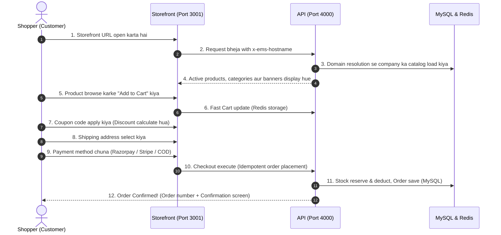

# EMS (E-Commerce Management System) — Complete End-to-End Flow Guide

Yeh document EMS platform ke **poore architecture, user roles, lifecycle flow, order lifecycle, aur technical design** ko detail aur aasan bhasha (Hindi/Hinglish) mein explain karta hai.

---

## 1. System Overview (Bada Picture)

**EMS = Multi-Tenant E-Commerce Management SaaS (Shopify jaisa platform).**

Ek hi platform aur database par hazaron alag-alag merchants (companies) apna online store chala sakte hain. Har company ka data 100% isolated aur private rehta hai.

```mermaid
flowchart TD
    subgraph Users["3 Main Actors / Users"]
        SA["Platform Super Admin\n(Platform Owner)"]
        M["Merchant / Store Owner\n(Company Admin & Staff)"]
        C["Shopper / Customer\n(End User)"]
    end

    subgraph Frontends["Frontend Portals"]
        Console["Console Admin Dashboard\n(Next.js — Port 3000)"]
        Storefront["Storefront Customer Shop\n(Next.js — Port 3001)"]
    end

    subgraph Backend["Core API Engine (Port 4000)"]
        API["NestJS Core API\n(Tenant Resolver, Auth, RBAC, Cart, Orders, Payments)"]
    end

    subgraph Storage["Databases & Queues"]
        MySQL[("MySQL 8.4\n(System of Record — Orders, Products, Tenants, Users)")]
        Redis[("Redis 8\n(Cache, Sessions, Cart, BullMQ Queues)")]
        Mongo[("MongoDB\n(Audit Logs, Event Stream, Analytics)")]
    end

    SA -->|Manage Tenants, Subscriptions, Platform Plans| Console
    M -->|Manage Products, Stock, Orders, Settings| Console
    C -->|Browse Products, Cart, Checkout, Order Tracking| Storefront

    Console -->|REST API Calls| API
    Storefront -->|REST API Calls (x-ems-hostname)| API

    API --> MySQL
    API --> Redis
    API --> Mongo
```

---

## 2. Portals, Services & Port Mapping

| Service | Technology | Port / URL | Kaam |
|---|---|---|---|
| **Console (Admin)** | Next.js 14 | `http://localhost:3000` | Super Admin aur Company Store Owners ke liye dashboard |
| **Storefront (Shop)** | Next.js 14 | `http://localhost:3001` | Shoppers / Customers ke liye shopping website |
| **API (Backend)** | NestJS | `http://localhost:4000` | Saara business logic, validation, aur database operations |
| **MySQL** | MySQL 8.4 | Port `3307` | Core financial aur transactional data (InnoDB) |
| **Redis** | Redis 8 | Port `6380` | High-speed cache, cart data, aur background job queues |
| **MongoDB** | Mongo 8.3 | Port `27017` | Immutable audit trail aur search analytics logs |

---

## 3. Pura Step-by-Step Lifecycle Flow

### Step 1: Company / Tenant Onboarding (Dukaan Khulna)
1. **Merchant Registration:**
   - Jab koi nayi company (jaise `Lyconi Pvt llt`) sign up karti hai:
   - System ek naya **Tenant** record banata hai (`tenant_id: 14`, slug: `lyconi-pvt-llt`).
   - Us company ke liye **Default Store** (`Lyconi Store`) provision hota hai.
   - Ek subdomain link hota hai: `lyconi-pvt-llt.ems.localhost:3001`.
   - Store Owner ka user account create hota hai (`test@lyconi.com`).

---

### Step 2: Merchant Store Setup (Console Admin - Port 3000)
Company ka owner [`http://localhost:3000/login`](http://localhost:3000/login) par login karke apni shop taiyar karta hai:
1. **Catalog (Products & Categories):**
   - Categories aur Brands banata hai.
   - Products create karta hai (Simple products ya multi-variants jaise Size/Color/Weight).
   - Price, SKU, Barcode, Images aur Tax Class set karta hai.
2. **Inventory (Warehouse Stock):**
   - Stock quantities dalta hai.
   - Low-stock threshold alert configure karta hai.
3. **Payments & Shipping:**
   - Online payment gateways enable karta hai (Razorpay, Stripe, Cashfree, PhonePe) ya Cash on Delivery (COD).
   - Shipping zones aur flat/weight-based delivery fees define karta hai.
4. **Marketing & Coupons:**
   - Discount coupon codes banata hai (Percentage, Flat Discount, ya Free Shipping).

---

### Step 3: Customer Shopping Flow (Storefront - Port 3001)



---

### Step 4: Order Fulfillment Flow (Console Admin - Port 3000)
Customer ke order place karte hi merchant dashboard par processing shuru hoti hai:

```
[Order Placed] ──> [Processing / Packing] ──> [Shipped / Dispatched] ──> [Delivered / Completed]
      │
      └──> (Agar cancel karna ho) ──> [Cancelled & Refunded]
```

1. **New Order Notification:**
   - Console ke `Orders` menu me new order alert dikhta hai (Status: `PENDING` ya `PAID`).
2. **Fulfillment (Pick & Pack):**
   - Merchant invoice aur packing slip download karta hai.
   - Status change hota hai: `PROCESSING`.
3. **Dispatch & Tracking:**
   - Courier company assign hoti hai aur tracking number generate hota hai.
   - Status change hota hai: `SHIPPED`. Customer ko SMS/Email tracking update jaati hai.
4. **Delivery & Completion:**
   - Package deliver hone par order status `DELIVERED` aur fir `COMPLETED` ho jaata hai.

---

### Step 5: Post-Purchase Flow (Reviews, Returns & Loyalty)
1. **Product Reviews:**
   - Customer product page par review aur ratings deta hai.
   - Merchant chahe to review ko verify, approve, reply ya moderate kar sakta hai.
2. **Invoices:**
   - Customer aur Merchant dono PDF format me tax-compliant invoices download kar sakte hain.
3. **Returns & Refunds:**
   - Agar product damage ya galat ho, customer order history se Return request daalta hai.
   - Merchant Console me return approve karta hai aur refund process initiate ho jaata hai.
4. **Loyalty Points:**
   - Har khareedari par customer ko points milte hain jo next order par discount ke roop me use ho sakte hain.

---

## 4. Technical Flow & Security Enforcements

### 1. 100% Strict Multi-Tenant Isolation
- Har incoming HTTP request me browser ka hostname check hota hai (`x-ems-hostname`).
- `TenantResolverMiddleware` us domain se `tenant_id` aur `store_id` nikal kar request context me securely attach kar deta hai.
- API ke sabhi SQL queries me automatically `WHERE tenant_id = :tenantId` enforce hota hai. Kisi bhi ek merchant ka data dusra merchant kabhi nahi dekh sakta.

### 2. Double-Entry Money Precision
- Financial calculations me floating-point numbers (`0.1 + 0.2`) ka use strictly prohibited hai.
- Tamam amounts **Minor Units (Paise ya Cents)** mein BigInt ke roop me store hote hain:
  - Example: ₹500.00 $\rightarrow$ `50000` paise.

### 3. Idempotency & Concurrency Safety
- Checkout aur payments par unique `idempotency-key` hoti hai.
- Agar customer payment button do baar jaldi-jaldi click kar de, tab bhi doosri bar request drop ho jaati hai aur customer se double charge nahi hota.

---

## 5. Ready Credentials Quick Reference

### Company / Tenant Admin (Console Dashboard)
- **URL:** [`http://localhost:3000/login`](http://localhost:3000/login)
- **Email:** `test@lyconi.com`
- **Password:** `DemoPassword123!`
- **Role:** `STORE_OWNER` (Tenant: `lyconi-pvt-llt`)

### Platform Super Admin
- **URL:** [`http://localhost:3000/login`](http://localhost:3000/login)
- **Email:** `admin@ems.local`
- **Password:** `AdminPassword123!`
- **Role:** `SUPER_ADMIN`

### Customer / Shopper Account
- **URL:** [`http://localhost:3001/account/login`](http://localhost:3001/account/login)
- **Email:** `test@lyconi.com`
- **Password:** `DemoPassword123!`
